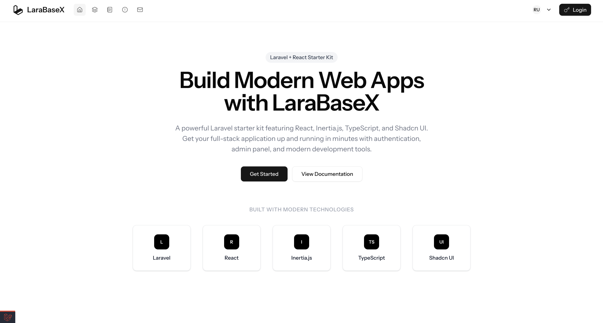

## 🚀  &nbsp; LaraBaseX
> A Laravel 12 + ReactJS Full Stack Starter Boilerplate.
This is a secure, modular, production-ready base project using Laravel 12 with ReactJS frontend, ideal for building scalable web applications without Blade.

[](https://example.com)
[](https://example.com)

## Overview

What LaraBaseX Is

A starter kit for developers who want to skip repetitive setup work and start building features right away.
- Laravel 12 backend → clean REST API architecture, ready for production.
- ReactJS frontend → Vite-based, integrated with API, UI ready with Shadcn.
- Security baked in → CSRF, CORS, Rate limiting, Sanitization.
- Roles & Permissions → Spatie permissions + UI protection.
- Full CRUDs ready → Users, Employees, Enquiries.
- Deployment ready → Works with Docker, VPS, or shared hosting.


Why It’s Useful
- Saves weeks of setup time by giving you authentication, authorization, logging, validation, helper functions, and database structure out of the box.
- Gives a modern dev experience — API response helpers, centralized error handling, custom commands, and frontend integration.
- Provides flexibility — you can scale it from small apps to enterprise-level solutions.


Included Major Features
- Backend → Laravel 12 API, Sanctum Auth, MySQL, Redis queues, Spatie permissions, custom helpers.
- Frontend → React + Shadcn UI, API integration, role-based UI.
- Dev Tools → PHPStan, Pest tests, ESLint, Pint, Postman tests, Docker dev setup.
- Security → HTTPS enforcement, CORS setup, CSRF tokens, rate limits.
- Production Ready → Queue workers, caching, mailers, exception logging, activity logs.

<p align="right"><a href="#top"></a></p>

<br>

<br>

<div id="top"></div>

##

### Table of content:

| No.     | Topics                                                                                  |
| ------- | --------------------------------------------------------------------------------------- |
| 0.      | [Tech Stack](#tech-stack)                                                               |
| 1       | [Features and Integrations](#features-and-integrations)                                                         |
| 2       | [Getting Started](#getting-started)                                                     |
| 3       | [Documentations](#documentations)                                                       |
| 4       | [Folder Structure](#folder-structure)                                                 |

<br>

<br>

#

## Tech Stack
> A modern tech stack for building scalable web applications.
- **Backend**: Laravel 12 (REST API)
- **Frontend**: ReactJS (Vite + Axios) + Shadcn UI
- **Database**: MySQL
- **Authentication**: Laravel Sanctum
- **Deployment Ready**: Docker / Shared Hosting / VPS


<p align="right"><a href="#top"></a></p>

<br>

<br>

#

## Features and Integrations

| Category         | Integrations & Features                                                                 |
|------------------|---------------------------------------------------------------------------------------|
| RDBMS            | MySQL, SQLite (default)                                                               |
| Storage          | Local, Unix File System                                                               |
| Message Queues   | Redis, Database (queue driver), Supervisor (production)                               |
| Mailers          | SMTP, Mailgun (via Laravel config)                                                    |
| Caching          | Redis, File                                                                           |
| Logging          | Monolog, custom exception handler, Spatie Activity Log                                |
| Validations      | FormRequest, custom validation rules                                                  |
| Transformers     | API response helpers                                                                  |
| Helpers          | Centralized helpers for API, formatting, utilities                                    |
| Internationalisation | Laravel's built-in i18n, language files                                           |
| Console Commands | Custom Artisan commands, scheduler                                                    |
| Security         | HTTPS, CORS, CSRF, Rate Limiting, Authorization, Input Sanitization                   |
| Frontend         | ReactJS (Vite), Shadcn UI, Inertia.js SPA routing                                     |
| Deployment       | Docker, Shared Hosting, VPS                                                           |
| Authentication  | Full login & registration flow with database-backed users                             |
| Dashboard       | Working dashboard UI and backend                                                      |
| Roles & Permissions | Create/manage roles, assign permissions, protect routes and UI                     |
| User Management | Full users CRUD (create, read, update, delete) and assign Roles & Permissions                                      |
| Employee Management | Employee CRUD (create, read, update, delete)  and assign Roles & Permissions                                    |
| Enquiry         | Enquiry section for user/customer queries                                             |

<p align="right"><a href="#top"></a></p>

<br>

<br>

#

## Getting Started
1. **Clone the repo:**
   ```sh
   git clone https://github.com/ayush-sleeping/LaraBaseX.git
   cd LaraBaseX
   ```

2. **Install backend dependencies:**
   ```sh
   composer install
   ```

3. **Install frontend dependencies:**
   ```sh
   npm install
   ```

4. **Copy and configure environment files:**
   ```sh
   cp .env.example .env
   ```
   - Update `.env` with your database credentials (MySQL recommended, SQLite supported).
   - Set up mail, cache, and other environment variables as needed.

5. **Generate application key:**
   ```sh
   php artisan key:generate
   ```

6. **Run database migrations and seeders:**
   ```sh
   php artisan migrate --seed
   ```

7. **Build frontend assets:**
   ```sh
   npm run build
   ```

8. **Start the Laravel backend server:**
   ```sh
   php artisan serve
   ```
   - Or use Docker for local development:
     ```sh
     docker-compose up
     ```

9. **Start the React frontend (Vite):**
   ```sh
   npm run dev
   ```

10. **Access the app:**
    - Backend API: [http://localhost:8000](http://localhost:8000)
    - Frontend: [http://localhost:5173](http://localhost:5173)

11. **Run tests and code quality checks:**
    - PHPStan (static analysis):
      ```sh
      ./vendor/bin/phpstan analyse
      ```
    - Pest (unit/feature tests):
      ```sh
      ./vendor/bin/pest
      ```
    - Pint (code style):
      ```sh
      ./vendor/bin/pint
      ```
    - ESLint (frontend lint):
      ```sh
      npm run lint
      ```
    - Postman/Newman (API tests):
      ```sh
      bash postman/test.sh
      ```
    - Health check:
      ```sh
      php test_health.php
      ```

<p align="right"><a href="#top"></a></p>

<br>

<br>

#


## Documentations
> Comprehensive guides and references for the codebase.

| No. | Topics | Includes |
| --- | ------- | -------- |
| 1 | [Security Essentials Documentation](documentation/1.%20Security%20Essentials/) | HTTPS Enforced, CORS Configured Properly, CSRF Protection and Others ... |
| 2 | [Architecture & Structure Essentials](documentation/2.%20Architecture%20&%20Structure%20Essentials/) | Helpers, Services, Job Queues, and Others ...  |
| 3 | [Packages to Include Documentation](documentation/3.%20Packages%20to%20Include/) | Spatie Laravel Permission, Laravel Sanctum,  and Others ...  |
| 4 | [Developer Experience Documentation](documentation/4.%20Developer%20Experience%20(DX)/) | Global Exception Handler, Standard API Response, Seeder & Factory  and Others ...  |
| 5 | [Frontend Integration Documentation](documentation/5.%20Frontend%20Integration%20(ReactJS)/) | Serve React with Vite, Proxy Setup, React Router  and Others ...  |
| 6 | [User Management Essentials](documentation/6.%20User%20Management%20Essentials/) | Auth APIs, Password Management, Roles & Permissions  and Others ...  |
| 7 | [Helper Functions Documentation](documentation/7.%20Helper%20Functions/) | Helper Functions |
| 8 | [MySQL Best Practices Documentation](documentation/8.%20MySQL%20Best%20Practices/) | MySQL Best Practices |
| 9 | [Deployment & Production Readiness](documentation/9.%20Deployment%20&%20Production%20Readiness/) | Deployment on server |
| 10 | [Authentication Flow Documentation](documentation/10.%20Authentication%20Flow%20Documentation/Authentication%20Flow%20Documentation%20docx.md) | Authentication Flow |
| 11 | [Authorization Flow Documentation](documentation/11.%20Authorization%20Flow%20Documentation/Authorization%20Flow%20Documentation%20docx.md) | Authorization Flow |
| 12 | [Setting Profile Information Update](documentation/12.%20Setting%20Profile%20Information%20Update/) | Profile Information Update |
| 13 | [Setting Password Update](documentation/13.%20Setting%20Password%20Update/) | Password Update |
| 14 | [Permission Based UI Implementation](documentation/14.%20Permission%20Based%20UI%20Implementation/) | Permission Based UI Implementation |
| 15 | [LaraBaseX Postman Collection](postman/README.md) | Postman Collection |
| 16 | [Testing](documentation/16.%20Testing/) | Testing Documentation |


<p align="right"><a href="#top"></a></p>

<br>

<br>

#

## Folder Structure
```
LaraBaseX/
├── app/
│   ├── Http/
│   │   ├── Controllers/
│   │   │   ├── Api/
│   │   │   │   ├── AuthController.php
│   │   │   │   ├── BaseApiController.php
│   │   │   │   └── HomeController.php
│   │   │   ├── Auth/
│   │   │   │   ├── AuthenticatedSessionController.php
│   │   │   │   ├── ConfirmablePasswordController.php
│   │   │   │   ├── EmailVerificationNotificationController.php
│   │   │   │   ├── EmailVerificationPromptController.php
│   │   │   │   ├── NewPasswordController.php
│   │   │   │   ├── PasswordController.php
│   │   │   │   ├── PasswordResetLinkController.php
│   │   │   │   ├── RegisteredUserController.php
│   │   │   │   └── VerifyEmailController.php
│   │   │   ├── Backend/
│   │   │   │   ├── DashboardController.php
│   │   │   │   ├── EmployeeController.php
│   │   │   │   ├── EnquiryController.php
│   │   │   │   ├── RoleController.php
│   │   │   │   └── UserController.php
│   │   │   ├── Frontend/
│   │   │   │   └── (empty)
│   │   │   ├── Settings/
│   │   │   │   ├── PasswordController.php
│   │   │   │   └── ProfileController.php
│   │   │   ├── Controller.php
│   │   │   └── HealthController.php
│   │   ├── Kernel.php
│   │   ├── Middleware/
│   │   │   ├── AdminAccess.php
│   │   │   ├── Authenticate.php
│   │   │   ├── BasicAuth.php
│   │   │   ├── EncryptCookies.php
│   │   │   ├── ForceHttps.php
│   │   │   ├── HandleAppearance.php
│   │   │   ├── HandleInertiaRequests.php
│   │   │   ├── PreventBackHistory.php
│   │   │   ├── PreventRequestsDuringMaintenance.php
│   │   │   ├── RedirectIfAuthenticated.php
│   │   │   ├── Token.php
│   │   │   ├── TrimStrings.php
│   │   │   ├── TrustHosts.php
│   │   │   ├── TrustProxies.php
│   │   │   ├── ValidateSignature.php
│   │   │   └── VerifyCsrfToken.php
│   │   └── Requests/
│   │       ├── Auth/
│   │       │   └── LoginRequest.php
│   │       ├── Settings/
│   │       │   └── ProfileUpdateRequest.php
│   │       └── (empty)
│   ├── Repositories/
│   │   └── Contracts/ (empty)
│   ├── Scopes/
│   │   └── HierarchyScope.php
│   ├── Services/
│   │   ├── BackupMonitoringService.php
│   │   ├── CacheWarmupService.php
│   │   └── QueryCacheService.php
│   ├── Traits/
│   │   ├── Cacheable.php
│   │   └── Hashidable.php
│   └── helpers.php
├── bootstrap/
│   ├── cache/
│   │   ├── .gitignore
│   │   ├── config.php
│   │   ├── packages.php
│   │   ├── routes-v7.php
│   │   └── services.php
│   ├── app.php
│   └── providers.php
├── config/
│   ├── app.php
│   ├── auth.php
│   ├── backup.php
│   ├── broadcasting.php
│   ├── cache.php
│   ├── cors.php
│   ├── database.php
│   ├── debugbar.php
│   ├── filesystems.php
│   ├── hashids.php
│   ├── hashing.php
│   ├── inertia.php
│   ├── l5-swagger.php
│   ├── logging.php
│   ├── mail.php
│   ├── permission.php
│   ├── proxy.php
│   ├── queue.php
│   ├── sanctum.php
│   ├── services.php
│   ├── session.php
│   ├── telescope.php
│   ├── trusted.php
│   ├── view.php
├── database/
│   ├── .gitignore
│   ├── database.sqlite
│   ├── factories/
│   │   └── UserFactory.php
│   ├── migrations/
│   │   ├── 0001_01_01_000000_create_users_table.php
│   │   ├── 0001_01_01_000001_create_cache_table.php
│   │   ├── 0001_01_01_000002_create_jobs_table.php
│   │   ├── 2025_08_01_000000_create_permissiongroups_table.php
│   │   ├── 2025_08_01_000001_create_permissions_table.php
│   │   ├── 2025_08_01_000002_create_roles_table.php
│   │   ├── 2025_08_01_000003_create_model_has_permissions_table.php
│   │   ├── 2025_08_01_000004_create_model_has_roles_table.php
│   │   ├── 2025_08_01_000005_create_role_has_permissions_table.php
│   │   ├── 2025_08_01_134338_create_personal_access_tokens_table.php
│   │   ├── 2025_08_04_000001_create_employees_table.php
│   │   ├── 2025_08_04_000002_create_enquiries_table.php
│   │   ├── 2025_08_04_075755_add_avatar_column_to_users_table.php
│   │   ├── 2025_08_08_063250_create_telescope_entries_table.php
│   │   ├── 2025_08_08_063402_create_activity_log_table.php
│   │   ├── 2025_08_08_063403_add_event_column_to_activity_log_table.php
│   │   └── 2025_08_08_063404_add_batch_uuid_column_to_activity_log_table.php
│   └── seeders/
│       ├── DatabaseSeeder.php
│       └── PermissionSeeder.php
├── documentation/
│   ├── 1. Security Essentials/
│   ├── 2. Architecture & Structure Essentials/
│   ├── 3. Packages to Include/
│   ├── 4. Developer Experience (DX)/
│   ├── 5. Frontend Integration (ReactJS)/
│   ├── 6. User Management Essentials/
│   ├── 7. Helper Functions/
│   ├── 8. MySQL Best Practices/
│   ├── 9. Deployment & Production Readiness/
│   ├── 10. Authentication Flow Documentation/
│   ├── 11. Authorization Flow Documentation/
│   ├── 12. Setting Profile Information Update/
│   ├── 13. Setting Password Update/
│   ├── 14. Permission Based UI Implementation/
│   └── 15. Testing/
├── lang/
│   ├── en/
│   └── vendor/
├── node_modules/
│   ├──
├── postman/
│   ├──
├── public/
│   ├── .htaccess
│   ├── apple-touch-icon.png
│   ├── build/
│   ├── favicon.ico
│   ├── favicon.svg
│   ├── index.php
│   ├── logo.svg
│   └── robots.txt
├── resources/
│   ├── css/
│   │   └── app.css
│   ├── js/
│   │   ├── app.tsx
│   │   ├── ssr.tsx
│   │   ├── ziggy.js
│   │   ├── components/
│   │   ├── hooks/
│   │   ├── layouts/
│   │   ├── lib/
│   │   ├── pages/
│   │   │   ├── auth/
│   │   │   ├── backend/
│   │   │   ├── frontend/
│   │   │   ├── settings/
│   │   │   ├── dashboard.tsx
│   │   │   ├── error.tsx
│   │   │   └── welcome.tsx
│   │   └── types/
│   └── views/
│       ├── app.blade.php
│       └── vendor/
│           └── l5-swagger/
├── routes/
│   ├── api.php
│   ├── auth.php
│   ├── backend.php
│   ├── channels.php
│   ├── console.php
│   ├── frontend.php
│   ├── settings.php
│   └── web.php
├── scripts/
│   └── phpstan.sh
├── storage/
│   ├── api-docs/
│   ├── app/
│   ├── debugbar/
│   ├── framework/
│   ├── logs/
│   └── pail/
├── stubs/
│   └──
├── tests/
│   ├── Feature/
│   ├── Pest.php
│   ├── TestCase.php
│   └── Unit/
├── vendor/
│   └── ... (all composer dependencies)
├── .editorconfig
├── .env
├── .env.example
├── .gitattributes
├── .github/
├── .gitignore
├── .prettierignore
├── .prettierrc
├── LICENSE
├── README.md
├── artisan
├── components.json
├── composer.json
├── composer.lock
├── eslint.config.js
├── package-lock.json
├── package.json
├── phpstan-baseline.neon
├── phpstan.neon
├── phpunit.xml
├── postman/
├── test_health.php
├── tsconfig.json
├── vite.config.ts
```

<p align="right"><a href="#top"></a></p>
