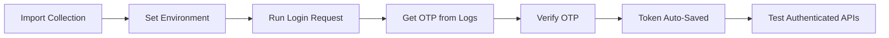

## 📮 LaraBaseX Postman Collection

A comprehensive, pre-configured Postman collection for the LaraBaseX API with automated testing, environment management, and complete authentication workflows.
### 🚀 Quick Start Guide

<br>

<br>

<div id="top"></div>

#

### Table of content:

| No.     | Topics                                                                                  |
| ------- | --------------------------------------------------------------------------------------- |
| 0.      | [1 Import Collection & Environment](#1-import-collection--environment)                  |
| 1       | [2 Set Active Environment](#2-set-active-environment)                                   |
| 2       | [3 Test Authentication Flow](#3-test-authentication-flow)                               |
| 3       | [Collection Structure](#collection-structure)                                           |
| 4       | [Environment Configuration](#environment-configuration)                                 |
| 5       | [Authentication Workflow](#authentication-workflow)                                     |
| 6       | [API Endpoints Reference](#api-endpoints-reference)                                     |
| 7       | [Testing Features](#testing-features)                                                   |
| 8       | [Advanced Usage](#advanced-usage)                                                       |
| 9       | [Sample Request Examples](#sample-request-examples)                                     |
| 10      | [Performance and Optimization](#performance-and-optimization)                           |
| 11      | [Troubleshooting](#troubleshooting)                                                     |
| 12      | [Benefits of This Collection](#benefits-of-this-collection)                             |


<br>

<br>

#

## 1 Import Collection & Environment

**Option A: Import Files**
```bash
# Import into Postman:
1. Collection: postman/LaraBaseX-API-Collection.json
2. Environment: postman/LaraBaseX-Local-Environment.json
```

**Option B: Import via URL**
```bash
# If hosted online, import directly:
Collection URL: https://your-domain.com/postman/LaraBaseX-API-Collection.json
Environment URL: https://your-domain.com/postman/LaraBaseX-Local-Environment.json
```

## 2 Set Active Environment
```bash
1. Open Postman
2. Click "Environments" in sidebar
3. Select "LaraBaseX Local Environment"
4. Ensure environment is active (top-right dropdown)
```

## 3 Test Authentication Flow
```bash
1. Run: "🔐 Authentication" → "Login with Mobile"
2. Check server logs for OTP (or use default: 1234)
3. Run: "🔐 Authentication" → "Verify OTP"
4.  Access token automatically saved!
5. Run: "👤 User Management" → "Get User Profile"
```


<p align="right"><a href="#top"></a></p>

<br>

<br>

#


## Collection Structure

### **📁 Folder Organization**

```
LaraBaseX API Collection/
├── 🔐 Authentication/          # Auth flow (Register, Login, OTP, Logout)
├── 👤 User Management/         # Profile operations
├── 🏠 Home & Content/          # App content endpoints
└── 📋 Sample Requests/         # Workflows and examples
    ├── 📱 Complete Authentication Flow/
    └── ❌ Error Handling Examples/
```

### **🔧 Built-in Features**

#### **Automated Token Management**
-  Auto-saves access token after OTP verification
-  Auto-includes Bearer token in authenticated requests
-  Auto-clears token on logout
-  Smart environment variable management

#### **Pre-Request Automation**
-  Auto-sets default mobile number and device ID
-  Generates unique device IDs for testing
-  Validates environment setup before requests

#### **Response Testing**
-  Automatic status code validation
-  Response time monitoring (< 5s)
-  JSON structure validation
-  Token extraction and storage


<p align="right"><a href="#top"></a></p>

<br>

<br>

#


## Environment Configuration

### **Local Development Environment**

| Variable | Default Value | Description |
|----------|---------------|-------------|
| `base_url` | `http://localhost:8001` | API base URL |
| `access_token` | *auto-set* | JWT authentication token |
| `mobile_number` | `9876543210` | Test mobile number |
| `device_id` | `test-device-postman-local` | Unique device identifier |
| `test_user_email` | `dev@example.com` | Sample user email |
| `test_user_password` | `Password123!` | Sample user password |

### **Production Environment**

| Variable | Default Value | Description |
|----------|---------------|-------------|
| `base_url` | `https://your-production-domain.com` | Production API URL |
| `access_token` | *auto-set* | JWT authentication token |
| `mobile_number` | `your-mobile-number` | Your real mobile number |
| `device_id` | `production-device-id` | Production device ID |
| `test_user_email` | `test@yourdomain.com` | Production test email |
| `test_user_password` | *set manually* | Secure production password |


<p align="right"><a href="#top"></a></p>

<br>

<br>

#

## Authentication Workflow

### **Complete Flow (Auto-Managed)**



### **Step-by-Step Instructions**

#### **Step 1: Login with Mobile**
```json
POST /api/login
{
    "mobile": "{{mobile_number}}",
    "device_id": "{{device_id}}"
}
```
**Result**: OTP sent to mobile (check server logs)

#### **Step 2: Verify OTP**
```json
POST /api/verify-otp
{
    "mobile": "{{mobile_number}}",
    "otp": "1234"
}
```
**Result**: Access token automatically saved to environment

#### **Step 3: Test Authenticated Request**
```json
POST /api/user
Headers: Authorization: Bearer {{access_token}}
```
**Result**: Returns authenticated user profile


<p align="right"><a href="#top"></a></p>

<br>

<br>

#

## API Endpoints Reference

### **🔐 Authentication Endpoints**

| Method | Endpoint | Description | Auth Required |
|--------|----------|-------------|---------------|
| `GET` | `/api/app-version` | Get app version and store URL | ❌ No |
| `POST` | `/api/register` | Register new user and send OTP | ❌ No |
| `POST` | `/api/login` | Login with mobile number and send OTP | ❌ No |
| `POST` | `/api/verify-otp` | Verify OTP and get access token | ❌ No |
| `POST` | `/api/resend-otp` | Resend OTP to mobile number | ❌ No |
| `POST` | `/api/logout` | Logout and revoke access token |  Yes |

### **👤 User Management Endpoints**

| Method | Endpoint | Description | Auth Required |
|--------|----------|-------------|---------------|
| `POST` | `/api/user` | Get authenticated user details |  Yes |
| `POST` | `/api/user/update` | Update user profile information |  Yes |
| `POST` | `/api/user/update-photo` | Upload/update profile photo |  Yes |

### **🏠 Content Endpoints**

| Method | Endpoint | Description | Auth Required |
|--------|----------|-------------|---------------|
| `POST` | `/api/sliders` | Get home page sliders |  Yes |


<p align="right"><a href="#top"></a></p>

<br>

<br>

#

## Testing Features

### **Automated Test Scripts**

#### **Authentication Tests**
```javascript
// Auto-save access token
if (pm.response.json().access_token) {
    pm.environment.set("access_token", pm.response.json().access_token);
    console.log(" Token saved automatically!");
}

// Auto-clear token on logout
pm.environment.unset("access_token");
console.log("🔓 Access token cleared from environment.");
```

#### **Response Validation**
```javascript
// Status code validation
pm.test("Status code is 200", function () {
    pm.response.to.have.status(200);
});

// Response structure validation
pm.test("Response has access_token", function () {
    var jsonData = pm.response.json();
    pm.expect(jsonData).to.have.property('access_token');
});

// Performance testing
pm.test("Response time is less than 5000ms", function () {
    pm.expect(pm.response.responseTime).to.be.below(5000);
});
```

### **Error Handling Examples**

#### **400 - Validation Error**
```json
POST /api/login
{
    "mobile": "invalid",
    "device_id": ""
}
```
**Response**: Validation error with field-specific messages

#### **401 - Unauthorized**
```json
POST /api/user
Headers: Authorization: Bearer invalid-token
```
**Response**: Unauthorized access error


<p align="right"><a href="#top"></a></p>

<br>

<br>

#


## Advanced Usage

### **Custom Environment Setup**

#### **Create New Environment**
1. Duplicate existing environment
2. Update `base_url` for your server
3. Set appropriate `mobile_number` for testing
4. Configure secure `test_user_password`

#### **Environment Variables**
```json
{
    "base_url": "https://staging.yourdomain.com",
    "access_token": "",
    "mobile_number": "1234567890",
    "device_id": "staging-device-123",
    "test_user_email": "staging@yourdomain.com",
    "test_user_password": "SecurePassword123!"
}
```

### **Bulk Testing with Newman**

#### **Install Newman CLI**
```bash
npm install -g newman
```

#### **Run Collection via CLI**
```bash
# Test local environment
newman run postman/LaraBaseX-API-Collection.json \
    -e postman/LaraBaseX-Local-Environment.json \
    --reporters cli,html \
    --reporter-html-export newman-report.html

# Test production environment
newman run postman/LaraBaseX-API-Collection.json \
    -e postman/LaraBaseX-Production-Environment.json \
    --reporters cli,json \
    --reporter-json-export newman-results.json
```

### **CI/CD Integration**

#### **GitHub Actions Example**
```yaml
name: API Testing
on: [push, pull_request]
jobs:
  test-api:
    runs-on: ubuntu-latest
    steps:
      - uses: actions/checkout@v2
      - name: Run Postman Collection
        run: |
          npm install -g newman
          newman run postman/LaraBaseX-API-Collection.json \
            -e postman/LaraBaseX-Local-Environment.json \
            --reporters junit \
            --reporter-junit-export api-test-results.xml
```


<p align="right"><a href="#top"></a></p>

<br>

<br>

#

## Sample Request Examples

### **Complete Authentication Flow**
```bash
# 1. Check app version
GET {{base_url}}/api/app-version

# 2. Login with mobile
POST {{base_url}}/api/login
{
    "mobile": "{{mobile_number}}",
    "device_id": "{{device_id}}"
}

# 3. Verify OTP (check server logs for OTP)
POST {{base_url}}/api/verify-otp
{
    "mobile": "{{mobile_number}}",
    "otp": "1234"
}

# 4. Test authenticated request
POST {{base_url}}/api/user
Headers: Authorization: Bearer {{access_token}}
```

### **File Upload Example**
```bash
POST {{base_url}}/api/user/update-photo
Headers:
  Authorization: Bearer {{access_token}}
  Content-Type: multipart/form-data
Body:
  photo: [select file] # JPG/PNG, max 2MB
```

### **Profile Update Example**
```json
POST {{base_url}}/api/user/update
Headers: Authorization: Bearer {{access_token}}
{
    "first_name": "John Updated",
    "last_name": "Doe Updated",
    "email": "john.updated@example.com"
}
```


<p align="right"><a href="#top"></a></p>

<br>

<br>

#

## Performance and Optimization

### **Built-in Performance Monitoring**
-  Response time validation (< 5 seconds)
-  Content-Type header validation
-  JSON structure validation
-  Token expiry handling

### **Request Optimization**
-  Minimal request payloads
-  Efficient authentication flow
-  Smart environment variable reuse
-  Automated cleanup scripts


<p align="right"><a href="#top"></a></p>

<br>

<br>

#

## Troubleshooting

### **Common Issues & Solutions**

#### **Issue: "access_token not set"**
```bash
Solution:
1. Run "Login with Mobile" request
2. Check server logs for OTP
3. Run "Verify OTP" with correct OTP
4. Token will be auto-saved to environment
```

#### **Issue: "mobile_number not set"**
```bash
Solution:
1. Check environment is selected (top-right dropdown)
2. Verify mobile_number variable exists in environment
3. Or set manually: mobile_number = "9876543210"
```

#### **Issue: "401 Unauthorized"**
```bash
Solution:
1. Check access_token is set in environment
2. Re-run authentication flow if token expired
3. Verify Bearer token format in Authorization header
```

#### **Issue: "OTP not received"**
```bash
Solution:
1. Check Laravel logs: storage/logs/laravel.log
2. Look for: "OTP for mobile 9876543210: XXXX"
3. Use the logged OTP in verify-otp request
4. Default test OTP: 1234
```

### **Debug Mode**
```javascript
// Add to request Pre-request Script for debugging
console.log("Environment:", pm.environment.name);
console.log("Base URL:", pm.environment.get("base_url"));
console.log("Mobile:", pm.environment.get("mobile_number"));
console.log("Token:", pm.environment.get("access_token") ? "Set" : "Not Set");
```


<p align="right"><a href="#top"></a></p>

<br>

<br>

#


## Benefits of This Collection

### **For Developers**
-  **Ready-to-Use**: Import and start testing immediately
-  **Automated Workflows**: Token management and authentication flow
-  **Comprehensive Testing**: All endpoints with validation scripts
-  **Environment Management**: Local, staging, production environments
-  **Error Handling**: Examples of validation and authorization errors

### **For Mobile App Developers**
-  **Authentication Reference**: Complete OTP-based login flow
-  **Request Examples**: Sample payloads for all endpoints
-  **File Upload Guide**: Profile photo upload with proper headers
-  **Error Response Examples**: Handle API errors gracefully

### **For QA Teams**
-  **Automated Testing**: Run via Newman CLI or CI/CD
-  **Performance Monitoring**: Response time and validation checks
-  **Regression Testing**: Consistent test scenarios
-  **Documentation**: Self-documenting API tests

### **For DevOps Teams**
-  **CI/CD Integration**: Newman CLI automation
-  **Environment Testing**: Multiple environment configurations
-  **Monitoring**: API health and performance validation
-  **Deployment Validation**: Automated post-deployment testing


<p align="right"><a href="#top"></a></p>

<br>

<br>

#
